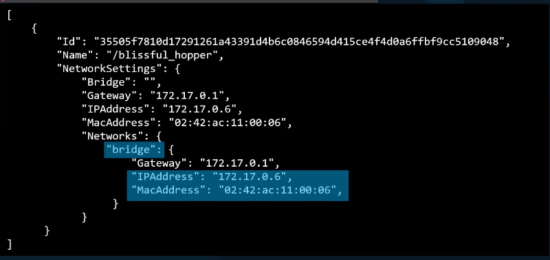

# Networking in docker

Preinstalled with Docker comes 3 networks

- Bridge
- none
- host

```bash
# View all networks
docker network ls

# NETWORK ID     NAME      DRIVER    SCOPE
# 2a5096f5fa8c   bridge    bridge    local
# b22ad148aeec   host      host      local
# e52595512190   none      null      local
```

The bridge network is the default network a container gets attached to if no network is specified.

`docker run alpine` will attach to the bridge network.

If we want to attach to any of the other networks, an explicit
assignment needs to be made.

- `docker run alpine --network=none`
- `docker run alpine --network=host`

## Bridge network

[Full docs on docker](https://docs.docker.com/network/bridge/)

The bridge network is private internal network created
by docker on the host. All containers attached to this network
usually gets assigned an ip in the range of `172.17.0.0`.

The containers in this network can access each other using their
internal `172.17.0.0` ip.


To access any of the containers from the host
we need to port map them, when spinning up the container
`docker run -p 80:8080 nginx`, where 80 is the internal port
and 8080 is the external port.

On docker it is called bridge, but on the host, it is called Docker0

```bash
 ip addr 
# ...
# 4: docker0: <NO-CARRIER,BROADCAST,MULTICAST,UP> mtu 1500 qdisc no queue state DOWN group default 
# link/ether 02:42:fd:c6:89:59 brd ff:ff:ff:ff:ff:ff
# inet 172.17.0.1/16 brd 172.17.255.255 scope global docker0
# valid_lft forever preferred_lft forever
```

## Host network (Only works on Linux)

When using the host network, that container’s network stack
is not isolated from the Docker host.
The container shares the host’s networking namespace, and
the container does not get its own IP-address allocated.
For instance, if you run a container which binds to port 5000 and you use host networking, the container’s application is available on port 5000 on the host’s IP address.

This also means that we cannot have 2 containers with the same
port openings, as they're not isolated from the host.


## None network

With the none network the containers do not have any
access to the external host or other containers.
They basically run in a completely isolated network.

The none network is used by Kubernetes as Docker network does not follow
the standard of CNI. When Kubernetes spins up a pod
with a container in it the command will be something like

```bash
docker run --network=none <image>
bridge add <networkNamespaceId> /var/run/netns/<networkNamespaceId>
```

## User-defined networks (recommended)

Some of the reasons to use user-defined networks include

- **Better isolation** \
  All containers without a --network specified are attached to the default bridge network. This can be a risk, as unrelated stacks/services/containers are then able to communicate.
  
- **Automatic DNS resolution between containers** \
  Containers on the default bridge network can only access each other by IP addresses, unless you use the `--link` option, which is considered legacy. On a user-defined bridge network, containers can resolve each other by name or alias. Further, using IP addresses
  is inferior to DNS as the IPs are dynamically provisioned.

  Imagine an application with a web front-end and a database back-end. If you call your containers web and db, the web container can connect to the db container at db, no matter which Docker host the application stack is running on.

  If you run the same application stack on the default bridge network, you need to manually create links between the containers (using the legacy `--link` flag). These links need to be created in both directions, so you can see this gets complex with more than two containers which need to communicate. Alternatively, you can manipulate the /etc/hosts files within the containers, but this creates problems that are difficult to debug.

- **Containers can be attached/detached on the fly** \
  During a container’s lifetime, you can connect or disconnect it from user-defined networks on the fly. To remove a container from the default bridge network, you need to stop the container and recreate it with different network options.

### Creating a custom network

A custom defined network can be specified by specifying the subnet and network name

```bash
# Arbitrary subnet range
docker network create --driver bridge --subnet 182.18.0.0/24 custom-isolated-network
```

### Inspecting networks

```bash
docker inspect blissful_hopper
```


