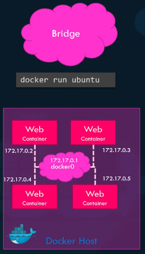
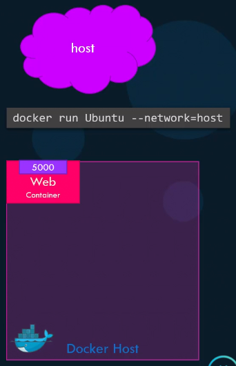

# Networking in docker

Preinstalled on Docker comes 3 networks

- Bridge
- none
- host

The bridge is the default network the container gets attached to.

`docker run alpine` will attach to the bridge network.

If we want to attach to any of the other networks, an explicit
assignment needs to be made.

- `docker run alpine --network=none`
- `docker run alpine --network=host`

## Bridge network

[Full docs on docker](https://docs.docker.com/network/bridge/)

The bridge network is private internal network created
by docker on the host. All containers attached to this network
usually gets assigned an ip in the range of `172.17.0.0`.

The containers in this network can access each other using their
internal `172.17.0.0` ip.

To access any of the containers from the host
we need to port map them, when spinning up the container
`docker run -p 80:8080 nginx`, where 80 is the internal port
and 8080 is the external port.

## Host network (Only works on Linux)

When using the host network, that container’s network stack
is not isolated from the Docker host.
The container shares the host’s networking namespace, and
the container does not get its own IP-address allocated.
For instance, if you run a container which binds to port 5000 and you use host networking, the container’s application is available on port 5000 on the host’s IP address.

This also means that we cannot have 2 containers with the same
port openings, as they're not isolated from the host.

## None network

With the none network the containers do not have any
access to the external host or other containers.
They basically run in a completely isolated network.

## User-defined networks (recommended)