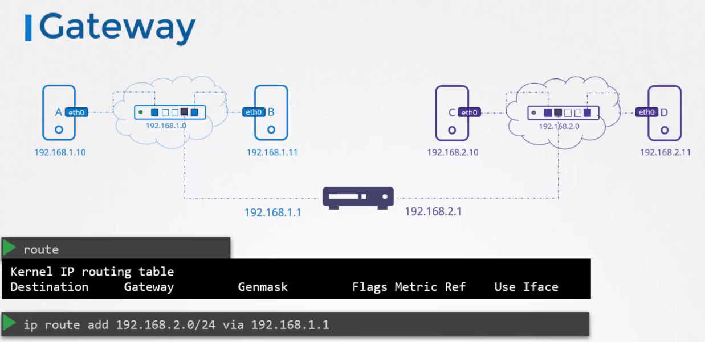
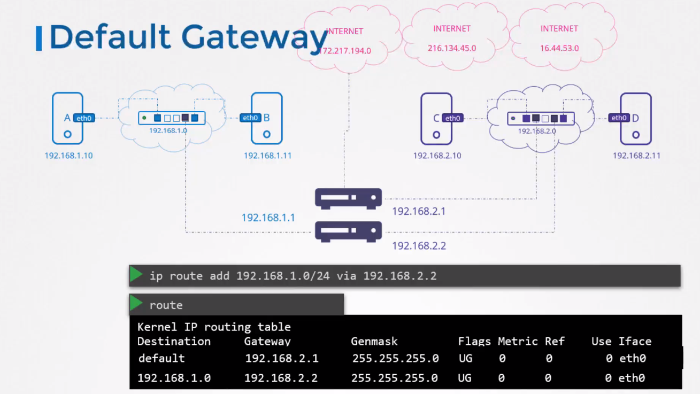

# Networking

Basic networking concepts...

## Ip Key Commands

list and modify interfaces on the host:  ``iplink``  
list assigned ip addresses to the interfaces: ``ip addr``  
set ip addresses on the interfaces: ``ip addr add 192.168.1.10/24 dev eth0`` (does not persist reboot, see above example for that)  
view routing table: ``route`` or ``ip route``  
add entries to the routing table: ``ip route add 192.168.1.0/24 via 192.168.2.1``  

### *From labs*

```bash
sudo ip addr add 172.16.238.15/24 dev eth0
sudo ip addr add 172.16.238.16/24 dev eth0
sudo ip addr add 172.16.239.15/24 dev eth0
sudo ip addr add 172.16.239.16/24 dev eth0

# iNet ip addresses (notice 238, and 239)
172.16.238.10/24
172.16.239.10/24

# On machines with ip addr 172.16.238.*
sudo ip route add 172.16.239.0/24 via 172.16.238.10

# On machines with ip addr 172.16.239.*
sudo ip route add 172.16.238.0/24 via 172.16.239.10

```

## Switching

A switch connects devices within the same network. E.g. 192.168.**1**.0 or 192.168.**2**.0 as shown below



The router connects the two switches, i.e. 192.168.1.1 & 192.168.2.1.

Running the command ``ip route add {ipaddress} via {ipaddress}`` connects the two as shown above.
This configuration has to be made on all the systems, meaning it's not enough to only configure one-way.  

```bash
ip route add 192.168.2.0/24 via 192.168.1.1
ip route add 192.168.1.0/24 via 192.168.1.1
```
This only configures the two networks to talk to each other. If we also want to connect to the internet, say for example Google. We'd need to add that to the routing.

```bash
ip route add 192.168.2.0/24 via 192.168.1.1
ip route add 192.168.1.0/24 via 192.168.2.1
ip route add 172.217.194.0/24 via 192.168.2.1
```
But because we do not know ALL the ip addresses of all hosts, we can set up the router to go via a default routing. ``ip route add default via 192.168.2.1``. It's basically the same as ``0.0.0.0``.  

However, if we both have an internal network as well as "public" network then we'd need to set that up.



To make ensure that routing works correctly, use ``ping {ipaddress}``. But on linux it has to be specified in a particular folder.  

```bash
cat proc/sys/net/ipv4/ip_forward
# Default value is 0
>> 0  
# Does not persist across reboots
echo 1 > proc/sys/net/ipv4/ip_forward 
>> 1

# If host is configured to act as a router configure value in
/etc/sysctl.conf
net.ipv4.ip_forward = #input number 
```

## DNS (Domain Name System)

Association of information with domain names assigned to entities.  

```bash
# Name resolution

# Host association can be found in
/etc/hosts
# For example
>> 192.168.1.1    db
>> 172.168.2.3    dev.rancher
```

However, this approach is cumbersome if there are hundreds or thousands of servers that need to be rerouted. Therefore a central server to solve this issue evolved, the DNS server. Servers then look at the DNS server instead of each hosts own 'hosts' file.  

DNS configuration can be found at ``/etc/resolv.conf``.  
Example..

```bash
cat /etc/resolv.conf
>> nameserver    192.168.1.100
```

This does not mean that we can't both have entries in the ``/etc/hosts`` file AND in the ``/etc/resolv.conf`` files. For example, if we have a test server that doesn't need to be resolved for others, then adding it to ``/etc/hosts`` would suffice.  
To prioritize between the two, we can go to ``/etc/nsswitch.conf``.  

For internal servers, say we have multiple subdomains like Google has; apps.google.com, drive.google.com etc. We can specify in our ``/etc/resolv.conf`` file that we should search within a domain, e.g. Google, for a subdomain, e.g. apps.  

```bash
cat /etc/resolv.conf
# resolv.conf
>> nameserver    192.168.1.100
# Adding the search, will allow the DNS to search within a domain for a subdomain.
>> search        google.com  

# terminal
ping apps
>> ping apps.google.com {ipAddress} 56(84) bytes of data.

# Multiple domains can also be searched for
# resolv.conf
>> nameserver    192.168.1.100
# Adding the search, will allow the DNS to search within a domain for a subdomain.
>> search        google.com  prod.google.com
```

### Record Types

|Name|Type|example|ip example|
|--|--|--|--|
|A|ipv4|web-server|192.168.1.1|
|AAAA|ipv6|web-server|--|2001:0db8:85a3:0000:0000:8a2e:0370:7734|
|CNAME|Map of an alias|food.web-server|eat.web-server.com, hungry.web-server.com|

### Ping / nslookup / dig

Ping may not always be the best way to check whether an ip is resolved. Nslookup can be beneficial because it provides additional information rather than just checking connectivity. **Nslookup does not look in the ``/etc/hosts`` file**

```bash
nslookup www.google.com

>> Server:		8.8.8.8
>> Address:	    8.8.8.8#53

>> Non-authoritative answer:
>> Name:	        google.com
>> Address:      142.250.74.46
```

If we want even further details we can use ``dig``.  

```bash
dig www.google.com

>> ; <<>> DiG 9.10.6 <<>> google.com
>> ;; global options: +cmd
>> ;; Got answer:
>> ;; ->>HEADER<<- opcode: QUERY, status: NOERROR, id: 29436
>> ;; flags: qr rd ra; QUERY: 1, ANSWER: 1, AUTHORITY: 0, ADDITIONAL: 1
>> ;; OPT PSEUDOSECTION:
>> ; EDNS: version: 0, flags:; udp: 512
>> ;; QUESTION SECTION:
>> ;google.com.			IN	A
>> ;; ANSWER SECTION:
>> google.com.		217	IN	A	216.58.211.14
>> ;; Query time: 30 msec
>> ;; SERVER: 8.8.8.8#53(8.8.8.8)
>> ;; WHEN: Sat Dec 26 09:47:27 CET 2020
>> ;; MSG SIZE  rcvd: 55
```

