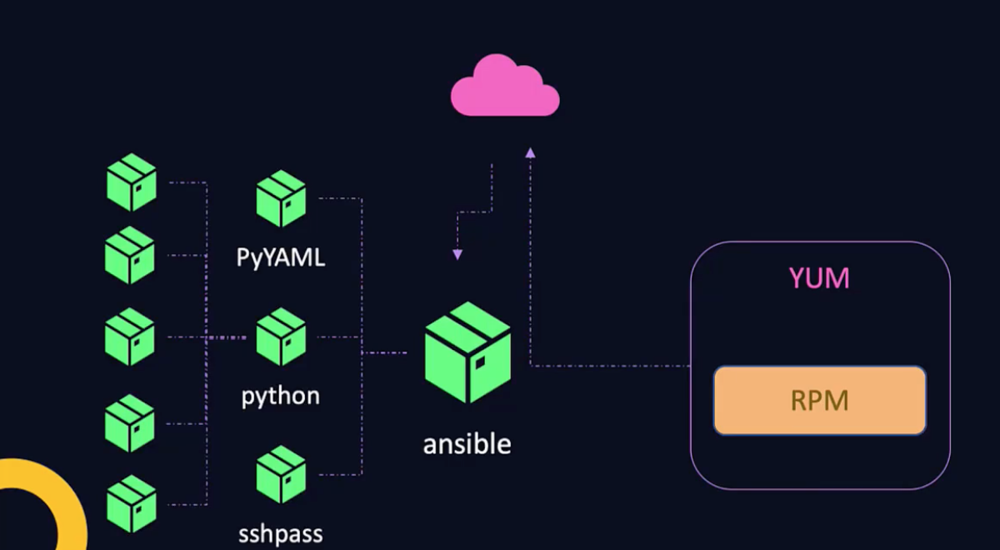

# Package management

## RPM (Redhat Package Manager)  

install telnet (package): ``rpm -i telnet.rpm``  
uninstall telnet (package): ``rpm -e telnet.rpm``  
query package: ``rpm -q telnet.rpm``  
query multiple: ``rpm -q telnet.rpm openssh-server ...``  
query all: ``rpm -qa``  
query specific: ``rpm -qa | grep packageName``  

Package managers does not install dependencies by themselves. For example, Anisble requires Python to be installed. This is why ``Yum`` exists....  
Yum is an abstraction layer on RPM, so it uses RPM underneath but with additions to install ALL required packages.  

  

### Yum commands  

list yum repo: ``yum repolist``  
list files in: ``ls /etc/yum.repos.d/``  
see url where package is gotten from: ``cat etc/yum/examplePackage.repo``  
list package: ``yum list packageName``  
remove package: ``yum remove packageName``  
list all available versions of package: ``yum --showduplicates list packageName``  
install package: ``yum install packageName # use flag -y to confirm``  
install specific version: ``yum install -y packageName-versionNumber``  
remove package: ``yum remove packageName``  

## Services
Services in Linux helps configure software to run in the background and make sure that they run all the time automatically when the servers are booted, and in the right order! Services should start in the right order, especially if there are multiple services which are dependant on each other.  

**HTTPD will be used as example of a service name**  
start HTTPD service: ``systemctl start httpd || service httpd start``  
stop running service: ``systemctl stop httpd``  
status of service: ``systemctl status httpd``  
configure HTTPD to start/stop at startup: ``systemctl enable/disable httpd``  
 
### Example of a python webapp running

```bash
/usr/bin/python3 /opt/code/my_app.py
# output:
#>>Serving Flask app "my_app" (lazy loading)
#>>Environment: production
#>> * Running on http://127.0.0.1:5000/

# curl to see if the service is running
curl http://localhost:5000
```
Using ``systemctl`` we can start/stop/status the service.  
start app: ``systemctl start my_app``  
stop app: ``systemctl stop my app``  

#### Configuring application to start on boot or restart if crashing
systemctl is used to manage ``systemd`` services. So we must configure the program as a systemd service.  
Systemd unit files are most likely located at ``/etc/systemd/system``  
The file for the program must be named what the program is eventually to be called. For example:  

```bash
~/etc/systemd/system # directory
> my_app.service # file
>>[Service] # service
>>ExecStart=/usr/bin/python3 /opt/code/my_app.py # application

# Let systemd know that of the new service configuration
systemctl daemon-reload

# Start the service
systemctl start my_app

# Check status
systemctl status my_app

# Curl to verify it works
curl http://localhost:5000
```

To configure the service to run on boot

```bash
~/etc/systemd/system # directory
my_app.service # file

>> [Unit] # Additional metadata
>> Description=Python web application

>>[Service] # service
>>ExecStart=/usr/bin/python3 /opt/code/my_app.py # application

# In case of crash set restart to always
>>Restart=always

# If other services should be run before or after add:
>>ExecPre=/opt/code/somescript1.sh
>>ExecPost=/opt/code/somescript2.sh

>>[Install]
>>WantedBy=multi-user.target # Configure to run AFTER the multi-user.target is started

# Enable for bootup
systemctl enable my_app

```
