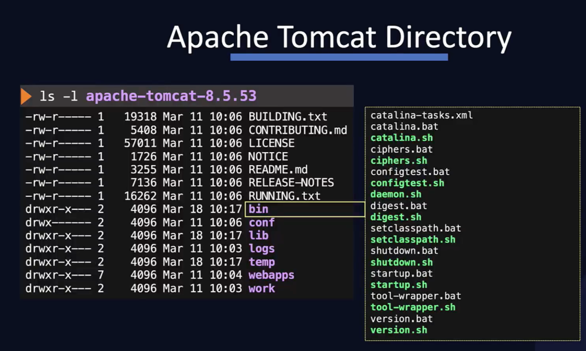
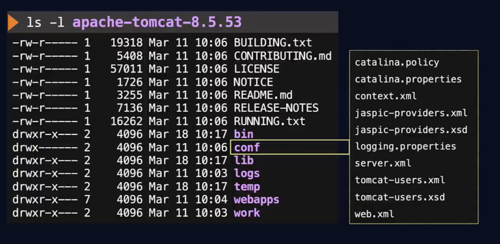

# Apache Tomcat

Apache Tomcat provides a webserver to host Java based web applications.  
A prerequisite on the server is to have Java installed.  

## Java Installation

```bash
yum install java-1.8.0-openjdk-devel
```  

## Apache Tomcat Installation

The Apache Tomcat also has to be downloaded from the [apache website](https://tomcat.apache.org/).  
Afterwards extract the downloaded package.  

```bash
wget https://downloads.apache.org/tomcat/tomcat-8/v8.5.53/bin/apache-tomcat-8.5.53.tar.gz
tar xvf apache-tomcat-8.5.53.tar.gz

# start the server
./apache-tomcat-8.5.53/bin/startup.sh

# check if it works
https://localhost:8080
```

## Tomcat directory

Files stored in the Tomcat directory is `apache-tomcat-8.5.53`.  

```bash
ls -l apache-tomcat-8.5.53
```

### Bin directory

In a subdirectory, the `bin` directory is located. It contains `.bat` files for Windows and `.sh` files for Linux based systems. Furthermore, the startup scripts `startup.sh` and shutdown scripts `shutdown.sh` are also located there.  



### Conf directory

Another subdirectory contains the configuration files in the `conf` directory. This is where the webserver is configured, e.g. what port to listen on or how to direct traffic between web apps.  



### Webapps directory

The webapps directory contains the webapps hosted by Tomcat. This is the place where the we want Apache to serve.

## Deploying the application to Apache Tomcat

Since Apache is used for Java based applications, we need to package the application. Multiple approaches can be used for this task.

=== "Java native"

    ```java
    // .war = Web Archive
    jar -cvf app.war *
    ```

=== "Maven"

    ```java
    mvn package
    ```

=== "Gradle"

    ```java
    maven build
    ```

Once the application is packaged, move the `.war` file to the `webapps` directory.  
If the service is running, it will automatically unpackage the `.war` file. However, check whether it's running may be a good idea.  

```bash
# View it in the log
cat ~/apache-tomcat-8.5.53/logs/catalina.out

# View in browser
https://localhost:8080/{AppName}
```

## From the labs

Install latest version of tomcat 8 on host01 server under `/opt/` directory. Please move extracted package to `/opt/apache-tomcat-8` to keep just major version for simplicity.  

### Download

```bash
sudo curl -O https://downloads.apache.org/tomcat/tomcat-8/v8.5.61/bin/apache-tomcat-8.5.61.tar.gz
sudo tar -xvf apache-tomcat-8.5.61.tar.gz
sudo mv apache-tomcat-8.5.61 /opt/apache-tomcat-8
```

### Start & Check if running  

Start service and check if tomcat is running on port 8080  

```bash
# Start service
/apache-tomcat-8/bin/startup.sh

# Check localhost if running
curl https://localhost:8080; ps -ef | grep tomcat
```

### Check if running on port 9090  

```bash
sudo sed -i 's/8080/9090/g' /opt/apache-tomcat-8/conf/server.xml
sudo /opt/apache-tomcat-8/bin/shutdown.sh
sudo /opt/apache-tomcat-8/bin/startup.sh
curl localhost:9090; ps -ef | grep tomcat
```