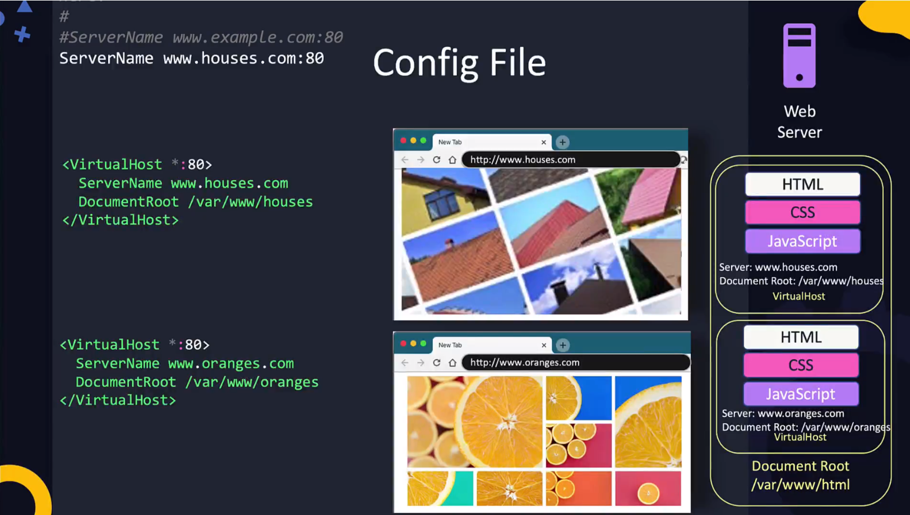

# Apache Web Server

Open source http server. It's a webserver usually used to serve HTML, CSS & JS. However, it is also often used in conjunction with an application server. Webservers usually serves static sites whereas application servers serve dynamic sites, to process logic and transactions.  

In CentOS apache is already included.  
In CentOS Apache is already available as a web server.  

```bash
# Install Apache Web Server
yum install httpd

# Start Service
service httpd start

# Check status
service httpd status

# Allow http (port 80) traffic
firewall-cmd --permanent --add-service=http
```

## Logs

Logs are located at the following paths

```bash
# Access Log - whenever a user accesses the website
/var/log/httpd/access_log

# Error Log - whenvever an error occurs
/var/log/httpd/error_log
```

## Config File

Look for configurations such as ServerName, DocumentRoot, Listen (port) etc.  
Important to note **ANY changes in the config file requires service restart** ``service httpd restart``

```bash
/etc/httpd/conf/httpd.conf
```

To point ServerName (e.g. www.houses.com:80), we have to point it to a DNS entry in the DNS server. Otherwise it won't know where to look for. Can also be done in the ``/etc/hosts`` to look in the local system first.

```bash
# /etc/hosts

127.0.0.1   localhost
127.0.0.1   www.houses.com
```

An apache webserver can host multiple sites. This is also specified in the config file.


When having multiple sites, it also makes sense to move each config file to their respective directory to not mix the two together.

```bash
# houses.com
/etc/httpd/conf/houses.conf
# oranges.com
/etc/httpd/conf/oranges.conf

# In the original config file include the new paths

# config file
Include conf/houses.conf
Include conf/oranges.conf 
```

## Access site

```bash
http://localhost:80

# Since it's http, port number is not needed.
http://localhost
```  
