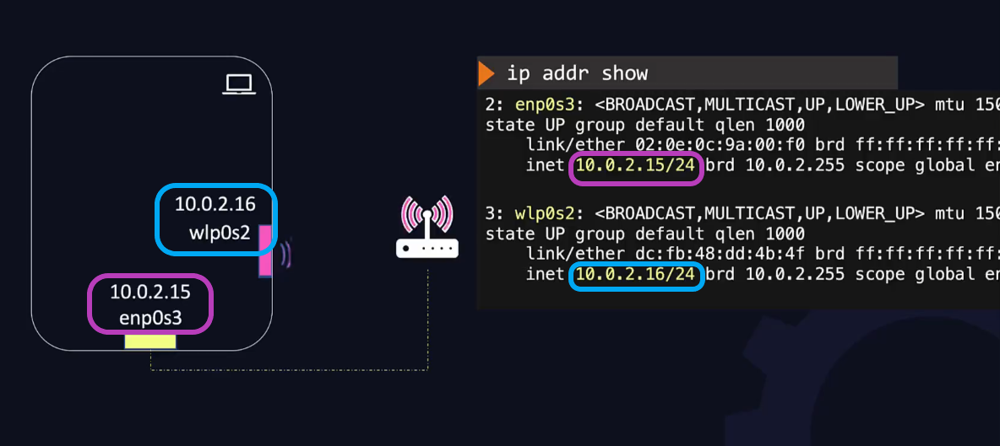

# Ip addresses and Ports from a Web Applciation Perspective

## FAQ

* What IP address and port should be used?
* localhost vs 127.0.0.1 vs IP address?
* Why can't I connect to my server?

---

## Ip Address and ports basics  

Laptops, servers etc. have different kinds of interfaces and adapters for connectivity such as Wired ethernet intefaces to connect to a LAN through a hub or switch, or Wireless to connect through Wi-Fi. No matter how the device is connected, it will get an ip address assigned to the device.

A device can have multiple ip addresses if they are connected to more than one adapter. For example, a laptop is both connected through ethernet and a wireless connection - illustrated below.



Each of the Network Interface Cards (NIC) are divided into logical components known as ports. It's possible to have up to 65535 ports on each ip address.

Each port is a communication endpoint. Programs can listen on these ports for requests. For example, a `flask` application listens on port 5000 by default, but can be configured in the code. If the device has multiple ip addresses the configuration for listening on the correct one also has to be configured. The following example illustrates the point.

```python
# main.py
from flask import Flask

app = Flask(__name__)

@app.route('/')
def hello():
    return 'Hello World!'

if __name__ == '__main__':
    app.run(port=8000, host=10.0.2.15)
```

The example makes the application available to a single ip address but it is also possible for both ip addresses (`10.0.2.15` and `10.0.2.16`) to be available for users to connect to. Instead we can specify the host to listen on all available interfaces with `host=0.0.0.0`.

Now the application is available to everyone to see, but if we want to just develop locally, we can simply remove the `host=`. When no option is specified the application will automatically listen on `127.0.0.1` (the loopback address).

The loopback address is the same on all devices, but the name `localhost` is the same. So we can access our test site using either `http://localhost:8000` or `http://127.0.0.1:8000`.

## Labs

### Exercise 1

*Run apache tomcat on all IP interfaces and port 9090 on host01 server.*

*We already downloaded apache tomcat under `/opt/apache-tomcat-8.5.53` directory.*

*Modify the necessary files and start tomcat.*

```bash
cd /opt/apache-tomcat-8.5.53
cd conf
> permission denied
sudo chmod -R 757 /opt
cd conf
cat server.xml

########## Output Snippet ##########

> A "Connector" represents an endpoint by which requests are received
> and responses are returned. Documentation at :
> Java HTTP Connector: /docs/config/http.html
> Java AJP  Connector: /docs/config/ajp.html
> APR (HTTP/AJP) Connector: /docs/apr.html
> Define a non-SSL/TLS HTTP/1.1 Connector on port 8080

> <Connector port="8080" protocol="HTTP/1.1"
> connectionTimeout="20000"
> redirectPort="8443" />

########## End Snippet ##########

sudo sed -i 's/8080/9090/g' apache-tomcat-8.5.53/conf/server.xml

########## Output Snippet ##########
> A "Connector" represents an endpoint by which requests are received
> and responses are returned. Documentation at :
> Java HTTP Connector: /docs/config/http.html
> Java AJP  Connector: /docs/config/ajp.html
> APR (HTTP/AJP) Connector: /docs/apr.html
> Define a non-SSL/TLS HTTP/1.1 Connector on port 9090
 
> <Connector port="9090" protocol="HTTP/1.1"
> connectionTimeout="20000"
> redirectPort="8443" />
> A "Connector" using the shared thread pool
 
> <Connector executor="tomcatThreadPool"
> port="9090" protocol="HTTP/1.1"
> connectionTimeout="20000"
> redirectPort="8443" />

########## End Snippet ##########

sudo ./apache-tomcat-8.5.53/bin/startup.sh
curl localhost:9090; ps -ef | grep tomcat
```

---

### Exercise 2

*We have cloned python app repo from github in /opt/ directory in app01 server. When you start it which IP and port combination it will listen on?*

*Python app file : `/opt/simple-webapp-flask/app.py`*

```bash
# Connect to the correct machine
ssh app01

cat opt/simple-webapp-flask/app.py

########## Output Snippet ##########

if __name__ == "__main__":
    app.run(host="0.0.0.0", port=8080)

########## End Snippet ##########
```

---

### Exercise 3

*In app01 server ensure that our app in /opt/simple-webapp-flask/ run on port 5000 and listen to 127.0.0.1 IP.* 

*Run python app in background with nohup*

*Note: Nohup stands for no hang up, which can be executed as shown below.*

`nohup command-with-options &`

<font size=2>*Adding "&" at the end will move the process to run in background. When you execute a Unix job in the background ( using &) and logout from the session, your process will get killed. You can avoid this with nohup.*</font>

```bash
# Modify the app.py file
vi app.py

# Before modification -- REMEMBER THE QUOTES!!!!
if __name__== "__main__":
    app.run(host="0.0.0.0", port=8080)

# After modification
if __name__== "__main__":
    app.run(port=5000)

# Alternatively
sudo sed -i 's/0.0.0.0/127.0.0.1/g;s/8080/5000/g' /opt/simple-webapp-flask/app.py

# Run python app in background with nohup
cd /opt/simple-webapp-flask
nohup python app.py &
```

### Exercise 4

*From app01 server is apache tomcat of host01 accessible?*

```bash
# Check if available
curl host01:9090

# It was available since apache tomcat was started on all IP interfaces
```

### Exercise 5

*From host01 server is Python flask of app01 server accessible?*

```bash
# It shouldn't be available since we changed the ip interface to 127.0.0.1
curl app01:5000

# As expected, it is not available
```

### Exercise 6

*Enable Flask app to be reachable from host01 and confirm by browser tab*

*To make app reachable from outside we have to bind app to global IP that will be used to access it or simply listen on all interfaces. In this case please make Flask app listen on all IP interfaces*

```bash
# Make the flask app listen on all IP interfaces
ssh app01

sudo sed -i 's/127.0.0.1/0.0.0.0/g' /opt/simple-webapp-flask/app.py

# Restart flask app
pkill python
cd /opt/simple-webapp-flask/
nohup python app.py &
```

### Exercise 7

*We added `app01` IP address `172.16.239.30` to flask application but seems curl `app01:5000` not working on `host01`. Please fix the issue so that curl `app01:5000` works as well as curl `172.16.239.30:5000` works on `host01`*

```bash
# Change app.py to be open to all ip addresses
sudo sed -i 's/172.16.239.30/0.0.0.0/g' /opt/simple-webapp-flask/app.py

# Restart flask app
sudo pkill python
cd /opt/simple-webapp-flask/
nohup python app.py &
```
