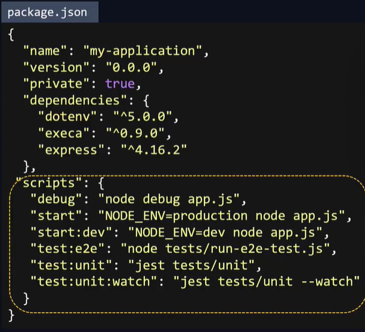

# NodeJS Express App

See also [NodeJS](../application-code-basics/nodejs.md)

Express is a NodeJS framework like Flask is a framework used for Python web applications.

## Project setup

Project structure may look as follows: 

```bash
my-application 
├── LICENSE
├── README.MD
├── package.json # Similar to requirements.txt for python
├── app.js # Similar to app.py or main.py for python
├── tests
├── config
├── routes
├── services
├── db
└── core
```

The app.js contains a sample web application:

```js
//app.js
const express = require('express')
const app = express()

app.get('/products' , (req, res) =>
                res.send(getProductList()))

app.use(express.static(path.join(__dirname, 'public')));

app.listen(3000);
```
Run requirements first `npm install`. It will run the package.json (list of dependencies) and install them.

Afterwards run `node app.js`

However, it may be a that there is defined a specific database for the `Dev` environment, then it'll be listed in the `package.json` file under `scripts`, as the excerpt below show



npm can then be used to run a specific script in the file.

`npm run start` to run the `start` script.

The start script has the environment variable set to production. We could also run

`npm run start:dev` to start the development environment.

When it is run, the webserver is listening on localhost `http://localhost:3000/`.

## Tools for running in production

However, this is not considered best practice. If the application were to crash, Node will simply shut the site down, preventing access to the application for other users.

 + supervisord
 + forever
 + pm2 (P(rocess) M(anager) 2)

pm2 is used in the example. It has built in load balancers.
To run our app with pm2

```bash
# start the application
pm2 start app.js

# start the application with multiple workers (cluster mode)
pm2 start app.js -i 4


### quickstart commands
#Start and Daemonize any application:
pm2 start app.js

#Load Balance 4 instances of api.js:
pm2 start api.js -i 4

#Monitor in production:
pm2 monitor

#Make pm2 auto-boot at server restart:
pm2 startup
```
